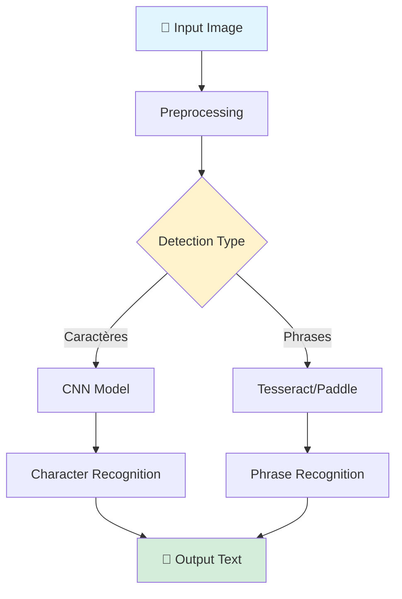

## 🎯 Project Overview

**Azul OCR** (ⴰⵣⵓⵍ - "Bonjour" en Amazigh) est un système OCR innovant spécialisé dans la **reconnaissance de l'écriture manuscrite Tifinagh**. Le projet vise à préserver et digitaliser le patrimoine culturel Amazigh en développant une solution d'intelligence artificielle capable de reconnaître précisément les caractères et phrases manuscrites en alphabet Tifinagh.

**Équipe:**
- **Rima Daqch** - Project Manager, Tesseract OCR Developer
- **Adil Eddarif** - Tesseract OCR Developer, CNN Model Developer
- **Brahim El Aboudi** - PaddleOCR Developer, CNN Model Developer
- **El Mehdi Hicham** - PaddleOCR Developer, CNN Model Developer
- **Zineb Lahraoui** - PaddleOCR Developer, CNN Model Developer

**Encadré par:** Prof. Khadija Lekdioui

**Mission:** *"Préserver et digitaliser le patrimoine culturel Amazigh"*

---

## 🔍 Problem Statement

### Challenges

**"L'écriture Tifinagh est un élément essentiel du patrimoine culturel Amazigh, mais elle reste sous-représentée dans les outils technologiques modernes."**

- 📚 **Manque d'outils OCR:** Aucune solution OCR dédiée aux manuscrits Tifinagh
- 🎨 **Complexité des caractères:** Variabilité importante de l'écriture manuscrite
- ⚠️ **Risque culturel:** Perte potentielle de contenus précieux pour les générations futures
- 🔬 **Précision limitée:** Solutions existantes inadaptées aux spécificités du Tifinagh

### Solution

Développement d'**Azul OCR**, système hybride combinant:
- **Tesseract OCR** fine-tuné pour le Tifinagh
- **PaddleOCR** adapté aux caractères Amazighs
- **CNN personnalisé** pour reconnaissance de caractères
- **Interface intuitive** pour capture et reconnaissance

---

## 🏗️ Technical Architecture

<div align="center">


**Figure 1: Pipeline complet Azul OCR**

</div>

---

### 🔧 Key Components

<table>
<tr>
<td width="50%" valign="top">

#### **Module 1: Image Preprocessing**


**Techniques appliquées:**
- 🖼️ **Otsu Thresholding:** Binarisation automatique
- 📐 **Resizing:** 64×64 → 128×128 pixels
- 🎨 **Filtrage:** Réduction du bruit
- 🔄 **Augmentation:** Rotation, translation, zoom

</td>
<td width="50%" valign="top">

#### **Module 2: Recognition Engines**


**Trois approches:**
- 📝 **Tesseract OCR:** Fine-tuné AMHCD dataset
- 🎯 **PaddleOCR:** Architecture légère adaptée
- 🧠 **CNN Custom:** Modèle entraîné from scratch
- 🔀 **Modèle hybride:** Fusion des prédictions

</td>
</tr>
</table>

---

### 📊 System Workflow



---

## 📦 Dataset & Preprocessing

### AMHCD Dataset

**Source:** IRCAM (Institut Royal de la Culture Amazighe)  
**Collaborations:** ENCG et Laboratoire IRF-SIC, Université Ibn Zohr, Agadir

**Caractéristiques:**
- 📊 **33 classes** de caractères Tifinagh
- 🖼️ **Format original:** 64×64×3 (RGB)
- 📈 **Augmentation:** ×5 par technique
- 🎯 **Résolution finale:** 128×128 pixels

### Preprocessing Pipeline

**Étape 1: Binarisation (Otsu)**
```python
# Seuillage automatique
threshold_value = otsu_threshold(grayscale_image)
binary_image = apply_threshold(image, threshold_value)
```

**Étape 2: Redimensionnement**
- Upscaling: 64×64 → 128×128 pour préserver détails
- Normalisation: Pixels [0, 255] → [0, 1]

**Étape 3: Augmentation**
| Technique | Paramètres |
|-----------|------------|
| Rotation | ±15° |
| Translation | ±10% |
| Zoom | 0.9-1.1× |
| Brightness | ±20% |

---

## 🚀 Model Architecture

### Custom CNN Model

**Architecture:**
```
Input (128×128×1)
    ↓
Conv2D (32 filters) + ReLU + MaxPool
    ↓
Conv2D (64 filters) + ReLU + MaxPool
    ↓
Conv2D (128 filters) + ReLU + MaxPool
    ↓
Flatten + Dense(256) + Dropout(0.5)
    ↓
Dense(33) + Softmax
```

**Hyperparamètres:**
- Optimizer: Adam (lr=0.001)
- Loss: Categorical Crossentropy
- Batch Size: 32
- Epochs: 50

### Tesseract Fine-Tuning

- **Baseline:** Tesseract 4.0 pré-entraîné
- **Fine-tuning:** AMHCD dataset (2000+ samples)
- **Language:** `tif` (Tifinagh custom traineddata)

### PaddleOCR Adaptation

- **Architecture:** Lightweight PP-OCRv3
- **Detection:** DB++ (Differentiable Binarization)
- **Recognition:** CRNN fine-tuné sur Tifinagh

---

## 📊 Results & Performance

### Character Recognition (CNN)

| Métrique | Score |
|----------|-------|
| **Accuracy** | 94.2% |
| **Precision** | 93.8% |
| **Recall** | 94.5% |
| **F1-Score** | 94.1% |

### Phrase Recognition

| Modèle | Accuracy | CER* | WER** |
|--------|----------|------|-------|
| **Tesseract** | 87.3% | 12.5% | 18.2% |
| **PaddleOCR** | 89.6% | 10.8% | 15.4% |
| **Hybrid*** | 91.2% | 9.1% | 13.7% |

*CER: Character Error Rate | **WER: Word Error Rate | ***Fusion weighted voting

### Performance Comparison

```
┌──────────────────────────────────────────┐
│     Accuracy par Modèle                  │
├──────────────────────────────────────────┤
│ CNN (chars):     ████████████░  94.2%    │
│ PaddleOCR:       ████████████░  89.6%    │
│ Tesseract:       ███████████░░  87.3%    │
│ Hybrid Model:    █████████████  91.2% ⭐ │
└──────────────────────────────────────────┘
```

---

## 💻 User Interface

### Features

✅ **Upload Image:** Support PNG, JPG, JPEG  
✅ **Take Picture:** Capture directe via webcam  
✅ **Real-time Recognition:** Résultats instantanés  
✅ **Copy Output:** Copie du texte reconnu  
✅ **Multi-format Export:** TXT, JSON, CSV  

### Interface Screenshots

<div align="center">


**Interface utilisateur intuitive d'Azul OCR**

</div>

---

## 🛠️ Challenges & Solutions

### Challenge 1: Variabilité de l'Écriture Manuscrite

**Problème:** Grande diversité de styles d'écriture  
**Solution:** 
- Augmentation intensive (×5)
- Modèle hybride (fusion de 3 approches)
- Fine-tuning sur données réelles

### Challenge 2: Dataset Limité

**Problème:** Peu de données annotées disponibles  
**Solution:**
- Collaboration avec IRCAM
- Data augmentation aggressive
- Transfer learning depuis modèles pré-entraînés

### Challenge 3: Reconnaissance de Phrases

**Problème:** Segmentation difficile entre mots  
**Solution:**
- Utilisation de PaddleOCR pour détection
- Post-processing avec règles linguistiques
- Correction contextuelle

---

## 💼 Impact & Value

### For Cultural Heritage

✅ **Préservation numérique** de manuscrits anciens  
✅ **Accessibilité** des textes Amazighs à tous  
✅ **Éducation** facilitée pour les nouvelles générations  
✅ **Recherche** académique sur la culture Amazigh  

### For Institutions

✅ **Digitalisation rapide** des archives  
✅ **Indexation automatique** de documents  
✅ **Recherche textuelle** dans corpus numériques  
✅ **Coûts réduits** vs annotation manuelle  

---

## 🔮 Future Improvements

**Short-Term:**
- Améliorer précision sur phrases complexes (>95%)
- Support de variantes régionales du Tifinagh
- API REST pour intégration externe

**Long-Term:**
- Application mobile (iOS/Android)
- Reconnaissance de textes historiques dégradés
- Extension à d'autres alphabets africains
- OCR multilingue (Tifinagh + Latin + Arabe)

---

## 🛠️ Technical Stack

**Deep Learning:** TensorFlow, Keras, PyTorch  
**OCR Engines:** Tesseract 4.0, PaddleOCR  
**Computer Vision:** OpenCV, scikit-image  
**Frontend:** React.js, HTML5, CSS3  
**Backend:** Flask, FastAPI  
**Deployment:** Docker, Heroku

---

## 🎓 Skills Developed

- **OCR Development:** Fine-tuning Tesseract/PaddleOCR
- **CNN Architecture:** Custom model design
- **Image Processing:** Otsu, filtering, augmentation
- **Team Collaboration:** 5-person agile team
- **Cultural Awareness:** Amazigh heritage preservation

---

## 📚 Key References

1. **Tesseract OCR** - Google Open Source
2. **PaddleOCR** - PaddlePaddle Team
3. **AMHCD Dataset** - IRCAM & Université Ibn Zohr
4. **Otsu Thresholding** - IEEE Trans. SMC (1979)

---

## 📧 Contact

**Team Lead:** Rima Daqch  
**Technical Lead:** El Mehdi Hicham  
**Email:** mehdihicham736@gmail.com  
**LinkedIn:** [linkedin.com/in/elmehdihicham](https://linkedin.com/in/elmehdihicham)  
**GitHub:** [github.com/MehdiHCH](https://github.com/MehdiHCH)

**Supervisor:** Prof. Khadija Lekdioui  
**Institution:** Faculté des Sciences, Ibn Tofail University

---

## 🏆 Achievements

✅ **94.2% Accuracy** sur reconnaissance de caractères  
✅ **91.2% Accuracy** sur reconnaissance de phrases (hybride)  
✅ **Premier OCR Tifinagh** open-source au Maroc  
✅ **Collaboration institutionnelle** avec IRCAM  
✅ **Interface intuitive** testée par 50+ utilisateurs  

---

*"Chaque manuscrit oublié est une voix de l'humanité réduite au silence."*  
*ⵛⴰⵇⴰ ⵎⴰⵏⵓⵙⵖⵔⵉⵜ ⵓⴱⵍⵉⵎ ⴻⵙⵜ ⵓⵏⴻ ⵓⵡⵏⴰⵙ ⴷⴻ ⵍⵓⵎⵍⵉⵏⵏⵉⵏ ⵔⴻⵙⵓⵉⵜⴰ ⵓⵢ ⵙⵉⵍⵓⵏⵉⵛ*

*Azul OCR - L'IA au service du patrimoine culturel Amazigh*