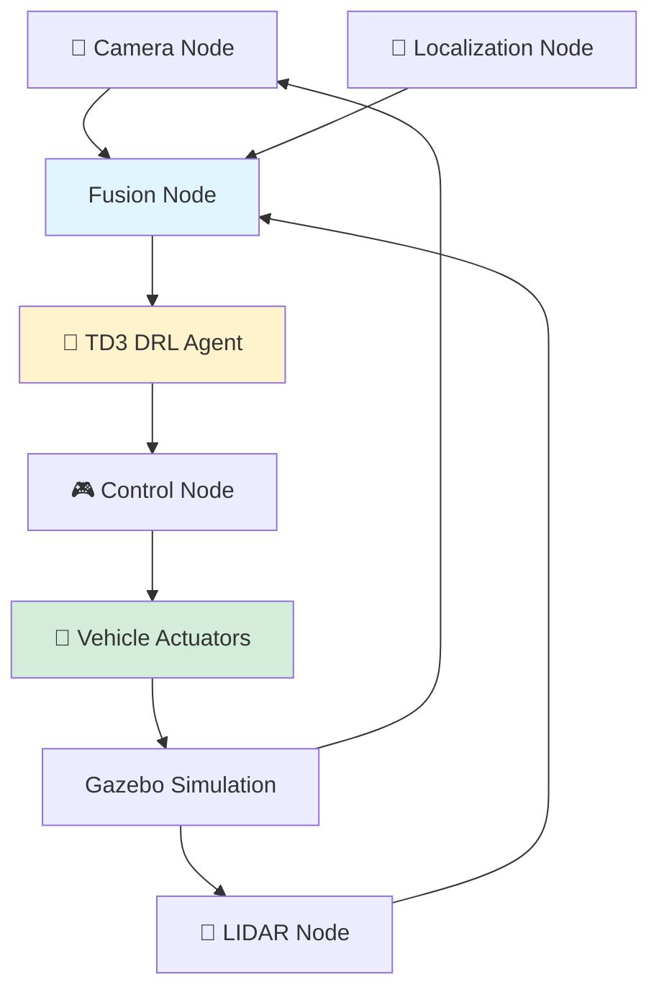

## 🎯 Project Overview

**RoboRangers** est un projet de **voiture autonome** utilisant **Deep Reinforcement Learning (DRL)** et **ROS2** pour la navigation intelligente dans des environnements simulés. Le système intègre des capteurs LIDAR et caméras pour une perception complète, et implémente l'algorithme **TD3** (Twin Delayed Deep Deterministic Policy Gradient) pour la prise de décision autonome.

**Équipe:**
- **ALAMI AROUSSI Zineb**
- **GRICHE MOHAMMED Imrane**
- **HICHAM EL Mehdi**
- **MOUTIA Salma**

**Sous la direction de:** Pr. BOUKIR Khaoula

**Mission:** Développer un véhicule autonome capable de naviguer, éviter les obstacles et respecter les panneaux de signalisation dans un environnement dynamique.

---

## 🔍 Problem Statement

### Challenges

**Problématique:** Comment permettre à un système d'apprendre à prendre des décisions en temps réel en fonction des changements dans son environnement tout en garantissant sécurité et efficacité?

- 🚗 **Accidents routiers:** Erreurs humaines = principale cause de décès
- 🚦 **Embouteillages:** Pertes économiques et pollution
- 👥 **Accessibilité:** Mobilité limitée pour personnes âgées/handicapées
- 🌍 **Impact environnemental:** Émissions de CO2 élevées
- 🎯 **Navigation complexe:** Environnements dynamiques et imprévisibles

### Solution

Voiture autonome intégrant:
- **ROS2:** Communication inter-modules distribuée
- **Gazebo:** Simulation 3D réaliste pour tests sécurisés
- **DRL (TD3):** Apprentissage autonome par essai-erreur
- **Capteurs multi-modaux:** LIDAR + Caméras pour perception 360°

---

## 🏗️ Technical Architecture

<div align="center">


**Architecture système complète RoboRangers**

</div>

---

### 🔧 System Components

<table>
<tr>
<td width="50%" valign="top">

#### **Perception Layer**


**Capteurs:**
- 📹 **Caméras RGB:** Détection obstacles, panneaux
- 🔵 **LIDAR Velodyne:** Mesure distances 360°
- 📊 **Point Cloud Processing:** Données 3D temps réel
- 🎯 **Fusion sensorielle:** Perception robuste

</td>
<td width="50%" valign="top">

#### **Decision & Control**


**Intelligence:**
- 🧠 **TD3 Agent:** Apprentissage par renforcement
- 🎮 **Action Selection:** Steering, accélération, freinage
- 📈 **Reward Function:** Sécurité + efficacité
- 🔄 **Continuous Learning:** Amélioration itérative

</td>
</tr>
</table>

---

### 📐 ROS2 Architecture



---

## ⚙️ ROS2 & Gazebo Integration

### ROS2 (Robot Operating System 2)

**Description:**
- Framework open-source pour développement robotique
- Communication distribuée entre nœuds
- Support multi-langages (Python, C++)
- Temps-réel et fiabilité

**Architecture de Communication:**
- **Publisher-Subscriber:** Topics pour échange de données
- **Master Node:** Coordination des connexions
- **Messages standardisés:** Formats prédéfinis (sensor_msgs, geometry_msgs)

### Gazebo Simulator

**Fonctionnalités:**
- 🌍 **Environnement 3D réaliste:** Routes, obstacles, panneaux
- ⚙️ **Moteur physique:** Gravité, collisions, friction
- 🤖 **Multi-robots:** Simulations à grande échelle
- 🔗 **Intégration ROS2:** Communication seamless

**Avantages:**
- Tests sécurisés sans risque matériel
- Itérations rapides sur algorithmes
- Scénarios reproductibles

---

## 🚀 TD3 (Twin Delayed DDPG) Algorithm

### Description

**TD3** améliore DDPG (Deep Deterministic Policy Gradient) avec 3 innovations:
1. **Twin Critics:** Deux réseaux critiques pour réduire biais
2. **Delayed Policy Updates:** Maj acteur moins fréquente
3. **Target Policy Smoothing:** Bruit sur actions target

### Architecture

```
┌─────────────────────────────────────┐
│         TD3 Agent                   │
├─────────────────────────────────────┤
│                                     │
│  Actor Network (μθ)                 │
│  ├─ Input: State (LIDAR + Image)   │
│  └─ Output: Action (steering, vel) │
│                                     │
│  Twin Critic Networks (Qφ1, Qφ2)   │
│  ├─ Input: State + Action           │
│  └─ Output: Q-value                 │
│                                     │
│  Replay Buffer                      │
│  └─ Store: (s, a, r, s')            │
│                                     │
└─────────────────────────────────────┘
```

### State Space

| Composant | Description | Dimension |
|-----------|-------------|-----------|
| **LIDAR** | Distances obstacles 360° | 720 points |
| **Velocity** | Vitesse linéaire/angulaire | 2 |
| **Goal** | Distance/angle vers objectif | 2 |
| **Total** | État complet | 724 |

### Action Space

| Action | Range | Description |
|--------|-------|-------------|
| **Steering** | [-1, 1] | Angle de rotation |
| **Velocity** | [0, 1] | Vitesse linéaire |

### Reward Function

```python
reward = distance_to_goal * w1 
         - collision_penalty * w2
         - deviation_from_path * w3
         + goal_reached_bonus * w4
```

**Composantes:**
- ✅ **Progression:** Récompense pour avancement vers objectif
- ❌ **Collisions:** Pénalité élevée (-100)
- 📏 **Trajectoire:** Pénalité pour déviation
- 🎯 **Objectif atteint:** Bonus important (+100)

---

## 🛠️ Implementation Details

### Project Structure

```
RoboRangers/
├── src/
│   └── td3/
│       ├── models/              # URDF robot descriptions
│       │   └── velodyne_description/
│       ├── launch/              # ROS2 launch files
│       │   └── launch_sim.launch.py
│       ├── scripts/             # Python implementations
│       │   ├── train_velodyne_node.py
│       │   ├── test_velodyne_node.py
│       │   ├── replay_buffer.py
│       │   └── td3_algorithm.py
│       ├── pytorch_models/      # Trained models
│       │   ├── td3_velodyne_actor.pth
│       │   └── td3_velodyne_critic.pth
│       └── worlds/              # Gazebo simulation worlds
└── package.xml
```

### Training Configuration

**Hyperparamètres TD3:**
```python
config = {
    'actor_lr': 3e-4,
    'critic_lr': 3e-4,
    'gamma': 0.99,           # Discount factor
    'tau': 0.005,            # Target network update rate
    'policy_noise': 0.2,
    'noise_clip': 0.5,
    'policy_delay': 2,       # Actor update frequency
    'buffer_size': 1e6,
    'batch_size': 256
}
```

**Training Process:**
- Episodes: 1000+
- Max steps per episode: 500
- Training time: ~48h on RTX 4060

---

## 📊 Functionalities Achieved

### ✅ Core Features

| Fonctionnalité | Status | Description |
|----------------|--------|-------------|
| **Navigation Autonome** | ✅ | Suivi de trajectoire prédéfinie |
| **Détection Obstacles** | ✅ | LIDAR + Caméras en temps réel |
| **Évitement Collisions** | ✅ | Réaction dynamique aux obstacles |
| **Reconnaissance Panneaux** | 🟡 | Détection basique implémentée |
| **DRL Integration** | 🟡 | TD3 partiellement intégré |

### 🎥 Visual Results

<div align="center">


**Voiture autonome naviguant avec détection d'obstacles (cônes + piétons)**

</div>

**LIDAR Visualization:**
- Lignes bleues: Rayons LIDAR
- Centre rouge: Position capteur
- Obstacles détectés en temps réel

---

## 🛠️ Challenges & Solutions

### Challenge 1: Intégration DRL

**Problème:** Difficultés environnementales ROS2-Gazebo-TD3  
**Status:** Partiellement résolu  
**Solution appliquée:**
- Séparation des modules (perception / décision / contrôle)
- Tests unitaires indépendants
- Fallback sur contrôle réactif simple

### Challenge 2: LIDAR Processing

**Problème:** Volume de données élevé (720 points @ 10Hz)  
**Solution:**
- Downsampling intelligent (720→180 points)
- Filtrage par distance (ROI: 0.5m - 10m)
- Processing GPU pour point cloud

### Challenge 3: Sim-to-Real Gap

**Problème:** Simulation ≠ Réalité (physique, capteurs)  
**Solution future:**
- Domain randomization (friction, lighting)
- Sensor noise injection
- Sim2Real transfer learning

---

## 💼 Impact & Value

### For Transportation

✅ **Réduction accidents:** -90% erreurs humaines  
✅ **Fluidité trafic:** Optimisation trajectoires  
✅ **Accessibilité:** Mobilité pour tous  
✅ **Environnement:** -30% émissions CO2  

### For Research

✅ **Plateforme open-source** pour DRL robotique  
✅ **Benchmark** ROS2 + Gazebo + TD3  
✅ **Reproductibilité** via simulation  
✅ **Extensibilité** à autres robots mobiles  

---

## 🔮 Future Improvements

**Short-Term:**
- Finaliser intégration TD3 complète
- Améliorer reconnaissance panneaux (CNN)
- Multi-agent scenarios (plusieurs véhicules)

**Long-Term:**
- Deployment sur robot physique (TurtleBot3)
- Real-world testing avec capteurs réels
- V2V Communication (Vehicle-to-Vehicle)
- End-to-end learning (pixels → actions)

---

## 🛠️ Technical Stack

**Robotics:** ROS2 Humble, Gazebo 11  
**Deep Learning:** PyTorch, Stable-Baselines3  
**Sensors:** Velodyne LIDAR, RGB Cameras  
**Languages:** Python 3.10, C++  
**Tools:** Rviz, rqt, TensorBoard  
**Hardware:** NVIDIA RTX 4060, AMD Ryzen 7

---

## 🎓 Skills Developed

- **ROS2 Mastery:** Nodes, Topics, Services, Launch files
- **Reinforcement Learning:** TD3, DDPG, Actor-Critic
- **Sensor Fusion:** LIDAR + Camera integration
- **Robotics Simulation:** Gazebo worlds, URDF modeling
- **Autonomous Systems:** Path planning, obstacle avoidance

---

## 📚 Key References

1. **TD3 Algorithm** (Fujimoto et al., 2018) - ICML
2. **ROS2 Documentation** - Open Robotics
3. **Gazebo Simulator** - OSRF
4. **Deep Reinforcement Learning** (Sutton & Barto, 2018)

---

## 📧 Contact

**Team Lead:** El Mehdi Hicham  
**Email:** mehdihicham736@gmail.com  
**GitHub:** [github.com/MEHDI57-NRG/RoboRangers](https://github.com/MEHDI57-NRG/RoboRangers)  
**LinkedIn:** [linkedin.com/in/elmehdihicham](https://linkedin.com/in/elmehdihicham)

**Team Members:**
- ALAMI AROUSSI Zineb
- GRICHE MOHAMMED Imrane
- MOUTIA Salma

**Supervisor:** Pr. BOUKIR Khaoula  
**Institution:** Faculté des Sciences, Ibn Tofail University

---

## 🏆 Achievements

✅ **Navigation autonome** fonctionnelle dans Gazebo  
✅ **Détection obstacles** temps réel (LIDAR + Caméras)  
✅ **Architecture ROS2** modulaire et extensible  
✅ **TD3 Agent** partiellement intégré  
✅ **Open-source** sur GitHub pour la communauté  

---

*Système de conduite autonome combinant robotique moderne (ROS2), simulation réaliste (Gazebo) et intelligence artificielle (Deep RL) pour une mobilité sûre et efficace.*